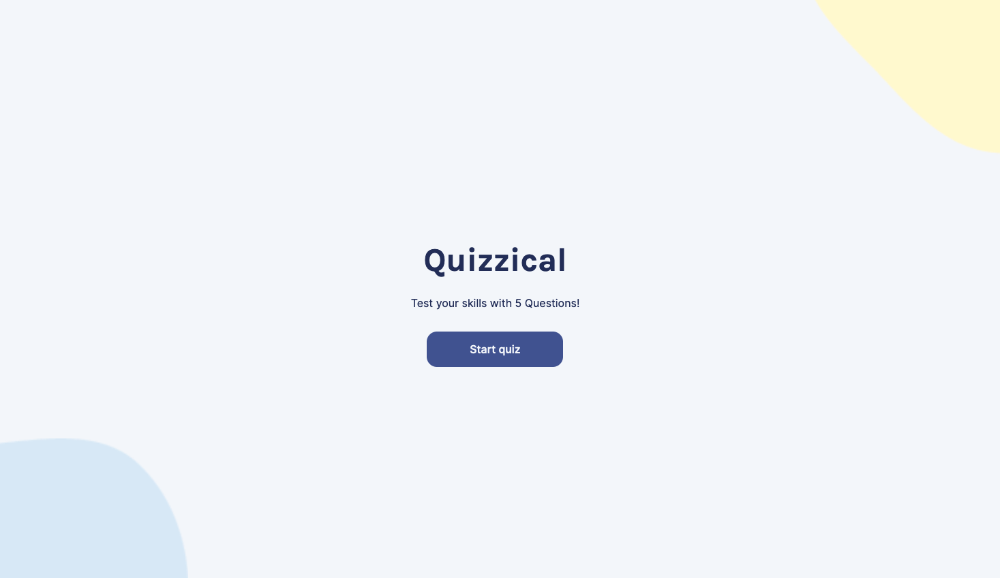
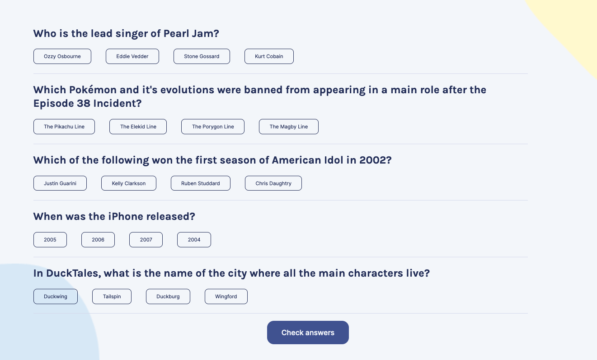
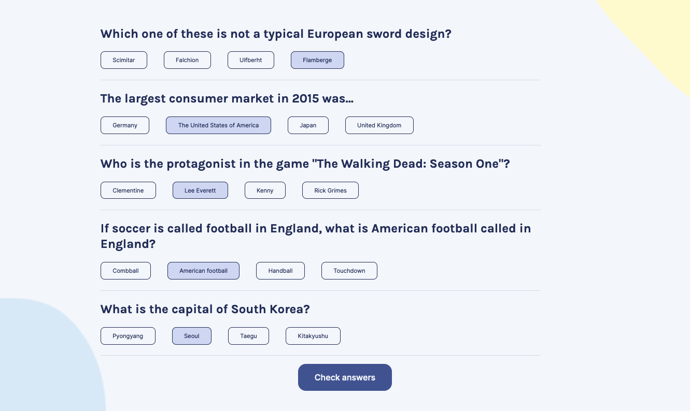
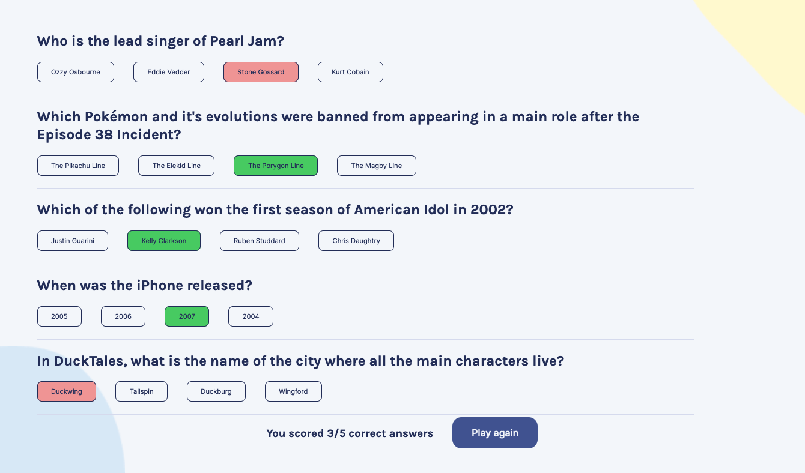

# Quizzical

## A small quiz app made in React. Quiz questions are retrieved from the Open Trivia API. All questions are multiple choice and set to "Easy" difficulty. This can be modified in the query.

### Screenshots

### The original design/layout references the figma file from one of Scrimba's React Courses (Scrimba.com)

### Functionality
The app has two pages, the first of which acts as a home page and retrieves the quiz question (string), incorrect_answers (array), and correct_answer (string) from the API. This can be seen in App.jsx where the state array stores each question object with its newly organized data. For example, all answers are grouped together to randomize the options and questions have their HTML entities removed. The state is then set with this data so it can be passed down as a prop to the QuizPage component. Additionally, there is state to display "...Loading" as the data is retrieved. As a side effect outside of React, the API call is made inside the useEffect hook. It takes an empty array as a dependency since it only needs to run once when opening the app.

The other page is also the QuizPage component and handles the logic of the quiz. The function inside useEffect immediately maps over the questions state prop passed down from App, and builds an object for each question with added "selected" (initialized to false) and "selectedAnswer" (initialized to an empty string) properties. The quizData state array is set with this new data. The options for each question are rendered as radio inputs, each confined within a form element so only one choice per question can be made. Each input has a label and it is the label that is styled to make the inputs look like buttons. The handleChange function connects with the radio input attributes and updates the quizData state with the selected answer and truthy selected property.

### Links
- Live URL: (https://mikos-quiz.netlify.app/)

### Built with
- React
- Vite

### Dependencies
- html entities
- uuidv4

### TODOs
"Play again" button should reload quiz page, not go back to home but call to API happens on home page.