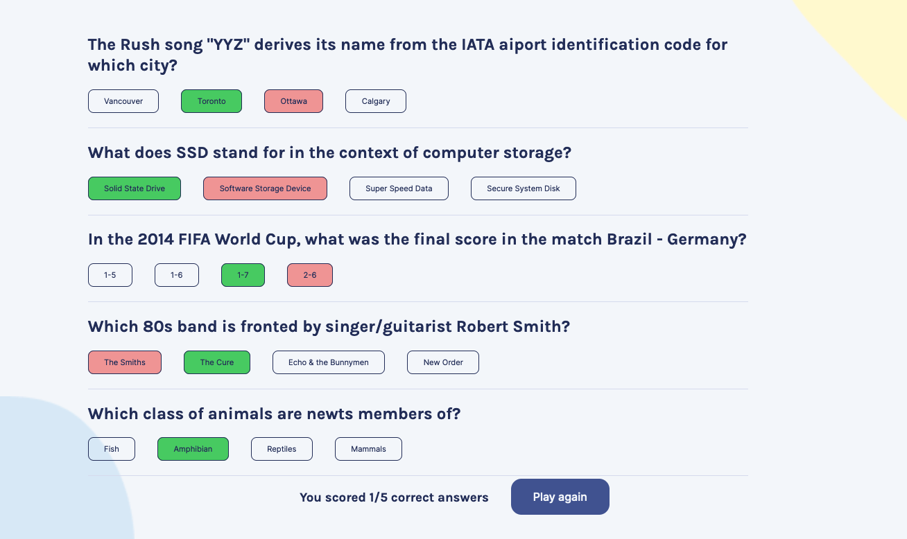

# Quizzical

### Overview 
A small quiz app made in React. Quiz questions are retrieved from the Open Trivia API. All questions are multiple choice and set to "Easy" difficulty. This can be modified in the query. The original design/layout references the figma file from one of Scrimba's React Courses (Scrimba.com)

### Screenshots

### Features
- The app has two pages, the first of which acts as a home page and retrieves the quiz data from the API (question, incorrect_answers, and correct_answer are the only ones used for this project) 
- All answers are grouped together to randomize the options and questions have their HTML entities removed. 
- There are 5 questions per quiz and a user must make all 5 selections to check their score.
- The score shows the amount correct out of 5 and also displays which answers are correct (for the questions that the user answered wrong). Right answers are displayed in green, wrong ones in red.

### Links
- Live URL: (https://mikos-quiz.netlify.app/)

### Built with
- React
- Vite

### Dependencies
- [html-entities](https://www.npmjs.com/package/html-entities)
- [uuidv4](https://www.npmjs.com/package/uuidv4)

### TODOs
"Play again" button should reload quiz page, not go back to home but call to API happens on home page.